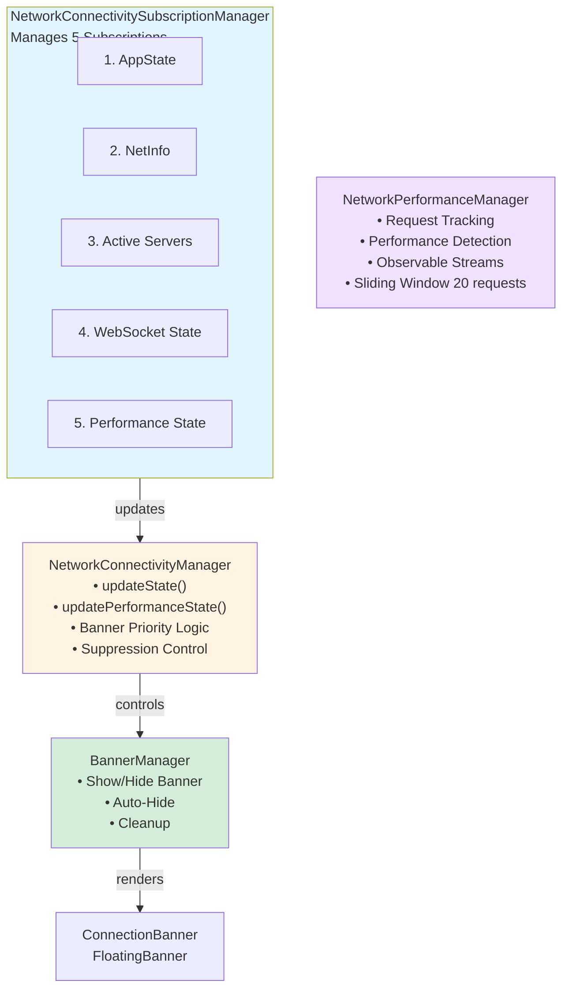
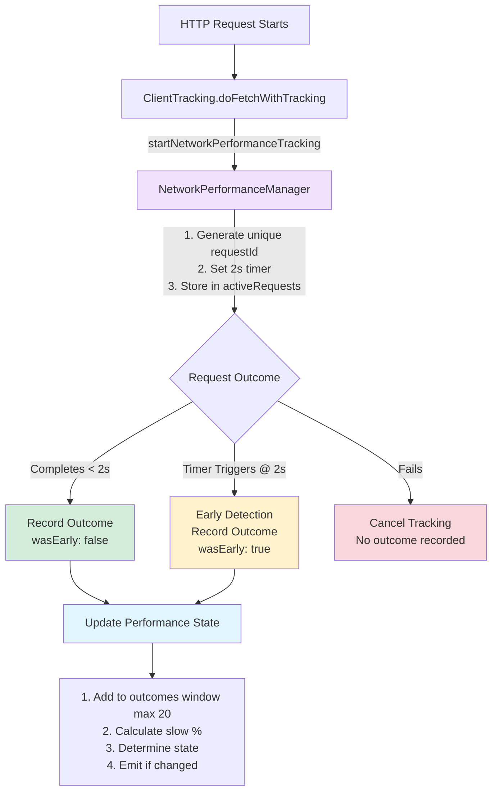
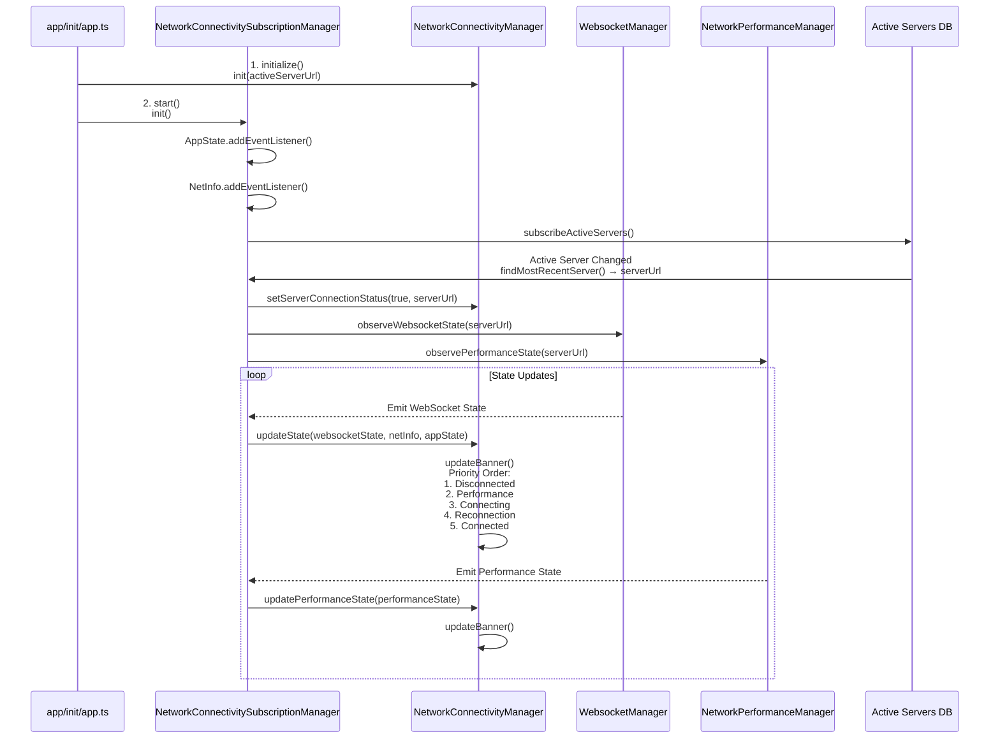

# Network Connectivity Observation System

## Table of Contents
- [Overview](#overview)
- [Architecture](#architecture)
- [System Components](#system-components)
- [Data Flow](#data-flow)
- [Technical Specifications](#technical-specifications)
- [Banner Display Logic](#banner-display-logic)
- [Performance Detection Algorithm](#performance-detection-algorithm)
- [Configuration](#configuration)

## Overview

The Network Connectivity Observation System is a comprehensive monitoring solution that tracks network performance and connectivity status in real-time, providing contextual feedback to users through an intelligent banner system.

### Key Features
- **Real-time Performance Monitoring**: Tracks request latency to detect network degradation
- **Early Detection System**: Identifies slow requests before completion (2s threshold)
- **Smart Banner Management**: Context-aware banner display with anti-spam mechanisms
- **Multi-Server Support**: Independent tracking per server URL
- **Lifecycle Management**: Handles app state transitions (background/foreground)

---

## Architecture

### System Diagram



---

## System Components

### 1. NetworkPerformanceManager

**Purpose**: Monitors request performance and detects network degradation

**Key Responsibilities**:
- Track active requests with unique IDs
- Detect slow requests (≥2000ms) early via timers
- Maintain sliding window of request outcomes (20 requests)
- Calculate performance state based on slow request percentage
- Emit performance state changes via RxJS observables

**Public API**:
```typescript
class NetworkPerformanceManager {
  // Start tracking a request, returns unique ID
  startRequestTracking(serverUrl: string, url: string): string
  
  // Complete tracking with metrics
  completeRequestTracking(serverUrl: string, requestId: string, metrics: ClientResponseMetrics): void
  
  // Cancel tracking on failure
  cancelRequestTracking(serverUrl: string, requestId: string): void
  
  // Observe performance state changes
  observePerformanceState(serverUrl: string): Observable<NetworkPerformanceState>
  
  // Get current state
  getCurrentPerformanceState(serverUrl: string): NetworkPerformanceState
  
  // Cleanup
  removeServer(serverUrl: string): void
}
```

### 2. NetworkConnectivityManager

**Purpose**: Orchestrates banner display based on connectivity and performance states

**Key Responsibilities**:
- Maintain current WebSocket, network, and performance state
- Implement banner display priority logic
- Handle suppression mechanisms
- Manage first connection vs reconnection scenarios

**Public API**:
```typescript
class NetworkConnectivityManager {
  // Initialize with server URL
  init(serverUrl: string | null): void
  
  // Update connection status
  setServerConnectionStatus(connected: boolean, serverUrl: string | null): void
  
  // Update WebSocket/network state
  updateState(
    websocketState: WebsocketConnectedState,
    netInfo: {isInternetReachable: boolean | null},
    appState: string
  ): void
  
  // Update performance state
  updatePerformanceState(performanceState: NetworkPerformanceState): void
  
  // Cleanup
  cleanup(): void
  shutdown(): void
}
```

### 3. NetworkConnectivitySubscriptionManager

**Purpose**: Coordinates all network-related subscriptions and server lifecycle

**Key Responsibilities**:
- Subscribe to app state changes (active/background)
- Subscribe to network info changes
- Subscribe to active server changes
- Subscribe to WebSocket state per server
- Subscribe to performance state per server

**Public API**:
```typescript
class NetworkConnectivitySubscriptionManager {
  // Initialize all subscriptions
  init(): void
  
  // Stop subscriptions (preserves AppState listener)
  stop(): void
  
  // Complete shutdown
  shutdown(): void
}
```

### 4. ClientTracking (Enhanced)

**Purpose**: Integrate performance tracking into network requests

**Integration Points**:
```typescript
class ClientTracking {
  doFetchWithTracking = async (url: string, options: ClientOptions) => {
    // 1. Start performance tracking
    const performanceRequestId = this.startNetworkPerformanceTracking(url);
    
    try {
      // 2. Execute request
      response = await request(url, this.buildRequestOptions(options));
      
      // 3. Complete tracking with metrics
      this.completeNetworkPerformanceTracking(performanceRequestId, url, response.metrics);
    } catch (error) {
      // 4. Cancel tracking on error
      this.cancelNetworkPerformanceTracking(performanceRequestId);
      throw error;
    }
  }
}
```

---

## Data Flow

### 1. Request Performance Tracking Flow



### 2. Subscription and State Flow



---

## Technical Specifications

### Performance Detection Algorithm

#### Constants
```typescript
const SLOW_REQUEST_THRESHOLD = 2000;                    // 2 seconds
const SLOW_REQUEST_PERCENTAGE_THRESHOLD = 0.7;          // 70%
const REQUEST_OUTCOME_WINDOW_SIZE = 20;                 // Last 20 requests
const MINIMUM_REQUESTS_FOR_INITIAL_DETECTION = 4;       // First detection
const MINIMUM_REQUESTS_FOR_SUBSEQUENT_DETECTION = 10;   // Later detections
```

#### State Calculation Logic
```typescript
function calculatePerformanceStateFromOutcomes(
  outcomes: RequestOutcome[], 
  isInitialDetection: boolean
): NetworkPerformanceState {
  const minimumRequests = isInitialDetection 
    ? MINIMUM_REQUESTS_FOR_INITIAL_DETECTION    // 4 requests
    : MINIMUM_REQUESTS_FOR_SUBSEQUENT_DETECTION; // 10 requests

  // Not enough data yet for initial detection
  if (isInitialDetection && outcomes.length < minimumRequests) {
    return 'normal';
  }

  const slowRequestCount = outcomes.filter(o => o.isSlow).length;
  const slowPercentage = slowRequestCount / outcomes.length;

  // Slow if ≥70% of requests are slow
  return slowPercentage >= SLOW_REQUEST_PERCENTAGE_THRESHOLD 
    ? 'slow' 
    : 'normal';
}
```

#### Early Detection System
```typescript
// When request tracking starts
startRequestTracking(serverUrl: string, url: string): string {
  const requestId = generateUniqueId();
  
  // Set timer for early detection
  const checkTimer = setTimeout(() => {
    // If still active after 2s, mark as slow
    if (activeRequests[requestId]) {
      recordRequestOutcome({
        timestamp: Date.now(),
        isSlow: true,
        wasEarlyDetection: true  // Flag for early detection
      });
      clearActiveRequest(requestId);
    }
  }, SLOW_REQUEST_THRESHOLD); // 2000ms
  
  activeRequests[requestId] = { id, url, startTime, checkTimer };
  return requestId;
}

// When request completes
completeRequestTracking(serverUrl: string, requestId: string, metrics: ClientResponseMetrics) {
  const wasEarlyDetected = !activeRequests[requestId]; // Already removed by timer
  
  clearActiveRequest(requestId);
  
  // Only record if not already recorded by early detection
  if (!wasEarlyDetected) {
    recordRequestOutcome({
      timestamp: Date.now(),
      isSlow: metrics.latency >= SLOW_REQUEST_THRESHOLD,
      wasEarlyDetection: false
    });
  }
}
```

### Sliding Window Management
```typescript
recordRequestOutcome(serverUrl: string, outcome: RequestOutcome) {
  if (!requestOutcomes[serverUrl]) {
    requestOutcomes[serverUrl] = [];
  }
  
  requestOutcomes[serverUrl].push(outcome);
  
  // Keep only last 20 requests
  if (requestOutcomes[serverUrl].length > REQUEST_OUTCOME_WINDOW_SIZE) {
    requestOutcomes[serverUrl] = requestOutcomes[serverUrl].slice(-REQUEST_OUTCOME_WINDOW_SIZE);
  }
  
  // Recalculate and emit new state
  const newState = calculatePerformanceStateFromOutcomes(
    requestOutcomes[serverUrl],
    isInitialDetection[serverUrl]
  );
  
  performanceSubject.next(newState);
}
```

---

## Banner Display Logic

### Priority Order (First Match Wins)

```typescript
private updateBanner() {
  // 0. Hide banner if no server or app in background
  if (!currentServerUrl || appState === 'background') {
    BannerManager.hideBanner();
    return;
  }

  // 1. HIGHEST PRIORITY: Disconnected state
  if (shouldShowDisconnectedBanner(websocketState, isOnAppStart)) {
    showConnectivity(false);  // Persistent banner
    return;
  }

  // 2. Performance degradation
  if (shouldShowPerformanceBanner(performanceState, performanceSuppressed)) {
    showPerformance(10000);   // Auto-hide after 10s
    return;
  }

  // 3. Connecting state
  if (shouldShowConnectingBanner(websocketState, isOnAppStart)) {
    showConnectivity(false);  // Persistent banner
    return;
  }

  // 4. Reconnection success
  if (shouldShowReconnectionBanner(websocketState, previousState, isOnAppStart)) {
    showConnectivity(true, 3000);  // Auto-hide after 3s
    return;
  }

  // 5. LOWEST PRIORITY: Connected (hide banner)
  BannerManager.hideBanner();
}
```

### Banner Decision Functions

#### Disconnected Banner
```typescript
shouldShowDisconnectedBanner(
  websocketState: WebsocketConnectedState | null,
  isOnAppStart: boolean
): boolean {
  return websocketState === 'not_connected' && !isOnAppStart;
}
```
- **Shows**: When disconnected after initial connection
- **Hides**: On first connection (app start)
- **Duration**: Persistent until state changes
- **Messages** (internationalized):
  - "The server is not reachable" (`connection_banner.not_reachable`) - when internet is reachable but server is not
  - "Unable to connect to network" (`connection_banner.not_connected`) - when internet is not reachable
  - "Connection status unknown" (`connection_banner.status_unknown`) - when websocketState or netInfo is null

#### Performance Banner
```typescript
shouldShowPerformanceBanner(
  performanceState: NetworkPerformanceState | null,
  performanceSuppressed: boolean
): boolean {
  return performanceState === 'slow' && !performanceSuppressed;
}
```
- **Shows**: When performance degrades to 'slow'
- **Suppression**: User can dismiss; suppressed until performance returns to 'normal'
- **Duration**: Auto-hide after 10 seconds
- **Message**: "Limited network connection" (`connection_banner.limited_network_connection`)

#### Connecting Banner
```typescript
shouldShowConnectingBanner(
  websocketState: WebsocketConnectedState | null,
  isOnAppStart: boolean
): boolean {
  return websocketState === 'connecting' && !isOnAppStart;
}
```
- **Shows**: When reconnecting after initial connection
- **Hides**: During first connection
- **Duration**: Persistent until state changes
- **Message**: "Connecting..." (`connection_banner.connecting`)

#### Reconnection Banner
```typescript
shouldShowReconnectionBanner(
  websocketState: WebsocketConnectedState | null,
  previousWebsocketState: WebsocketConnectedState | null,
  isOnAppStart: boolean
): boolean {
  return websocketState === 'connected' &&
         previousWebsocketState !== 'connected' && 
         !isOnAppStart;
}
```
- **Shows**: When connection restored after being disconnected/connecting
- **Hides**: On first connection
- **Duration**: Auto-hide after 3 seconds
- **Message**: "Connection restored" (`connection_banner.connected`)

### Message Internationalization

All banner messages are internationalized using `formatMessage()` for proper localization:

```typescript
private getConnectionMessage(): string {
  // Guard against uninitialized state
  if (!this.websocketState || !this.netInfo) {
    return this.intl.formatMessage({
      id: 'connection_banner.status_unknown', 
      defaultMessage: 'Connection status unknown'
    });
  }

  return getConnectionMessageText(
    this.websocketState, 
    this.netInfo.isInternetReachable, 
    this.intl.formatMessage
  );
}
```

**Message Keys**:
- `connection_banner.status_unknown` - When websocketState or netInfo is null
- `connection_banner.connected` - Connection restored
- `connection_banner.connecting` - Connecting...
- `connection_banner.not_reachable` - Server not reachable (but internet is)
- `connection_banner.not_connected` - Unable to connect to network
- `connection_banner.limited_network_connection` - Performance degraded

### Suppression Mechanisms

#### Performance Suppression
```typescript
// User dismisses performance banner
onDismiss: () => {
  this.performanceSuppressedUntilNormal = true;
}

// Reset when performance returns to normal
updatePerformanceState(performanceState: NetworkPerformanceState) {
  if (this.performanceSuppressedUntilNormal && performanceState === 'normal') {
    this.performanceSuppressedUntilNormal = false;
  }
}
```

#### First Connection Logic
```typescript
// isOnAppStart flag prevents banners on initial connection
updateState(websocketState, netInfo, appState) {
  this.previousWebsocketState = this.websocketState;
  this.websocketState = websocketState;
  
  this.updateBanner();
  
  // Clear flag only after first successful connection
  if (websocketState === 'connected' && this.isOnAppStart) {
    this.isOnAppStart = false;
  }
}
```

---

## Configuration

### User Preference

**Low Connectivity Monitor** (User Setting):
- Accessible in: Settings → Advanced Settings → Experimental Features
- Controls real-time performance monitoring and banner display
- Enables early detection and network performance tracking
- **Independent** from `CollectNetworkMetrics`
- Stored in app-level database via `GLOBAL_IDENTIFIERS.LOW_CONNECTIVITY_MONITOR`
- Default: **Enabled** (true)
- Observable via `observeLowConnectivityMonitor()` from `@queries/app/global`

#### Implementation Details

**Actions** (`app/actions/app/global.ts`):
```typescript
export const storeLowConnectivityMonitor = async (enabled: boolean) => {
  return storeGlobal(GLOBAL_IDENTIFIERS.LOW_CONNECTIVITY_MONITOR, enabled, false);
};
```

**Queries** (`app/queries/app/global.ts`):
```typescript
export const observeLowConnectivityMonitor = () => {
  const query = queryGlobalValue(GLOBAL_IDENTIFIERS.LOW_CONNECTIVITY_MONITOR);
  if (!query) {
    return of$(true);  // Default to enabled
  }
  return query.observe().pipe(
    switchMap((result) => (result.length ? result[0].observe() : of$(true))),
    switchMap((v) => {
      if (typeof v === 'boolean') {
        return of$(v);
      }
      return of$(v?.value ?? true);
    }),
  );
};
```

### Integration in ClientTracking

```typescript
class ClientTracking {
  private lowConnectivityMonitorEnabled = true;

  constructor(apiClient: APIClientInterface) {
    this.apiClient = apiClient;
    
    // Subscribe to user preference changes
    observeLowConnectivityMonitor().subscribe((enabled) => {
      this.lowConnectivityMonitorEnabled = enabled;
    });
  }

  startNetworkPerformanceTracking(url: string): string | undefined {
    if (!this.lowConnectivityMonitorEnabled) {
      return undefined;
    }
    return NetworkPerformanceManager.startRequestTracking(this.apiClient.baseUrl, url);
  }

  completeNetworkPerformanceTracking(
    requestId: string | undefined,
    url: string,
    metrics: ClientResponseMetrics | undefined
  ) {
    if (!this.lowConnectivityMonitorEnabled || !requestId || !metrics) {
      return;
    }
    NetworkPerformanceManager.completeRequestTracking(this.apiClient.baseUrl, requestId, metrics);
  }

  cancelNetworkPerformanceTracking(requestId: string | undefined) {
    if (!this.lowConnectivityMonitorEnabled || !requestId) {
      return;
    }
    NetworkPerformanceManager.cancelRequestTracking(this.apiClient.baseUrl, requestId);
  }
}
```

**Network metrics collection** (existing - for telemetry):
```typescript
if (groupLabel && CollectNetworkMetrics) {
  this.incrementRequestCount(groupLabel);
  this.trackRequest(groupLabel, url, response.metrics);
  this.decrementRequestCount(groupLabel);
}
```

### Network Manager Configuration

**Metrics Collection** (`app/managers/network_manager.ts`):
```typescript
const config = {
  sessionConfiguration: {
    timeoutIntervalForRequest: managedConfig?.timeout ? parseInt(managedConfig.timeout, 10) : this.DEFAULT_CONFIG.sessionConfiguration?.timeoutIntervalForRequest,
    timeoutIntervalForResource: managedConfig?.timeoutVPN ? parseInt(managedConfig.timeoutVPN, 10) : this.DEFAULT_CONFIG.sessionConfiguration?.timeoutIntervalForResource,
    waitsForConnectivity: managedConfig?.useVPN === 'true',
    collectMetrics: true,  // Always enabled to support Low Connectivity Monitor
  },
  headers,
};
```

**Note**: `collectMetrics` is now always set to `true` to ensure network metrics are available for the Low Connectivity Monitor. The actual usage of these metrics is controlled dynamically by the user's Low Connectivity Monitor preference in `ClientTracking`.

---

## Lifecycle Management

### App State Transitions

```typescript
// AppState: active → background
handleAppStateChange(nextAppState: AppStateStatus) {
  if (nextAppState !== 'active') {
    // 1. Clear all active request timers
    clearAllActiveRequests();
    
    // 2. Reset performance state to normal
    performanceSubjects.forEach(subject => subject.next('normal'));
    
    // 3. Hide all banners
    BannerManager.hideBanner();
    
    // 4. Stop subscriptions (except AppState listener)
    NetworkConnectivitySubscriptionManager.stop();
  }
}

// AppState: background → active
handleAppStateChange(nextAppState: AppStateStatus) {
  if (nextAppState === 'active') {
    // Restart all subscriptions
    NetworkConnectivitySubscriptionManager.init();
  }
}
```

### Server Lifecycle

```typescript
// Server added/activated
handleActiveServersChange(servers: Server[]) {
  const activeServer = findMostRecentServer(servers);
  
  if (activeServer) {
    // 1. Set connection status
    NetworkConnectivityManager.setServerConnectionStatus(true, activeServer.url);
    
    // 2. Subscribe to WebSocket state
    websocketSubscription = WebsocketManager
      .observeWebsocketState(activeServer.url)
      .subscribe(state => {
        NetworkConnectivityManager.updateState(state, netInfo, appState);
      });
    
    // 3. Subscribe to performance state
    performanceSubscription = NetworkPerformanceManager
      .observePerformanceState(activeServer.url)
      .subscribe(state => {
        NetworkConnectivityManager.updatePerformanceState(state);
      });
  }
}

// Server removed/logout
terminateSession(serverUrl: string) {
  // 1. Clear connection status
  NetworkConnectivityManager.setServerConnectionStatus(false, serverUrl);
  
  // 2. Remove performance tracking
  NetworkPerformanceManager.removeServer(serverUrl);
  
  // 3. Stop subscriptions
  NetworkConnectivitySubscriptionManager.stop();
}
```

---

## Performance Characteristics

### Memory Usage
- **Request Outcomes**: Max 20 per server (sliding window)
- **Active Requests**: Cleared on completion or 2s timeout
- **Timers**: One per active request, auto-cleared

### Detection Speed
- **Early Detection**: 2 seconds (timer-based)
- **Initial Detection**: 4-8 slow requests (4 minimum)
- **Subsequent Detection**: 10-20 requests (10 minimum with 70% threshold)

### Banner Timing
- **Disconnected**: Immediate, persistent
- **Connecting**: Immediate, persistent
- **Performance**: After threshold met, auto-hide 10s
- **Reconnected**: Immediate, auto-hide 3s

---

## Error Handling

### Request Failure
```typescript
try {
  response = await request(url, options);
  completeRequestTracking(requestId, response.metrics);
} catch (error) {
  // Cancel tracking - no outcome recorded
  cancelRequestTracking(requestId);
  throw error;
}
```

### Missing Metrics
```typescript
completeRequestTracking(requestId, metrics) {
  if (!metrics) {
    // Silently skip - no outcome recorded
    clearActiveRequest(requestId);
    return;
  }
  // ... record outcome
}
```

### Subscription Cleanup
```typescript
// Safe to call multiple times
stop() {
  websocketSubscription?.unsubscribe();
  performanceSubscription?.unsubscribe();
  netInfoSubscription?.();
  activeServersUnsubscriber?.unsubscribe();
  
  // Clear references
  websocketSubscription = undefined;
  performanceSubscription = undefined;
  // ...
}
```

---

## Testing Strategy

### Unit Tests
- **NetworkPerformanceManager**: Request tracking, state calculation, sliding window
- **NetworkConnectivityManager**: Banner decision functions, state transitions
- **NetworkConnectivitySubscriptionManager**: Subscription lifecycle, server changes

### Test Coverage
- Early detection (timer triggers)
- Request completion before/after threshold
- State transitions (normal ↔ slow)
- Banner priority order
- Suppression mechanisms
- App lifecycle (background/foreground)
- Server lifecycle (add/remove)
- Error scenarios (missing metrics, failed requests)

---

## Future Enhancements

### Potential Improvements
1. **Adaptive Thresholds**: Adjust SLOW_REQUEST_THRESHOLD based on historical performance
2. **Network Type Awareness**: Different thresholds for WiFi vs Cellular
3. **Exponential Backoff**: For repeated performance banners
4. **Metrics Reporting**: Send detection events to analytics
5. **User Preferences**: Allow users to configure sensitivity

### Known Limitations
1. **Single Server Focus**: Only monitors most recently active server
2. **Fixed Thresholds**: 2s threshold may not suit all use cases
3. **No Geographical Context**: Doesn't account for server location
4. **Binary States**: Only 'normal' vs 'slow' (no 'excellent' or 'poor')
