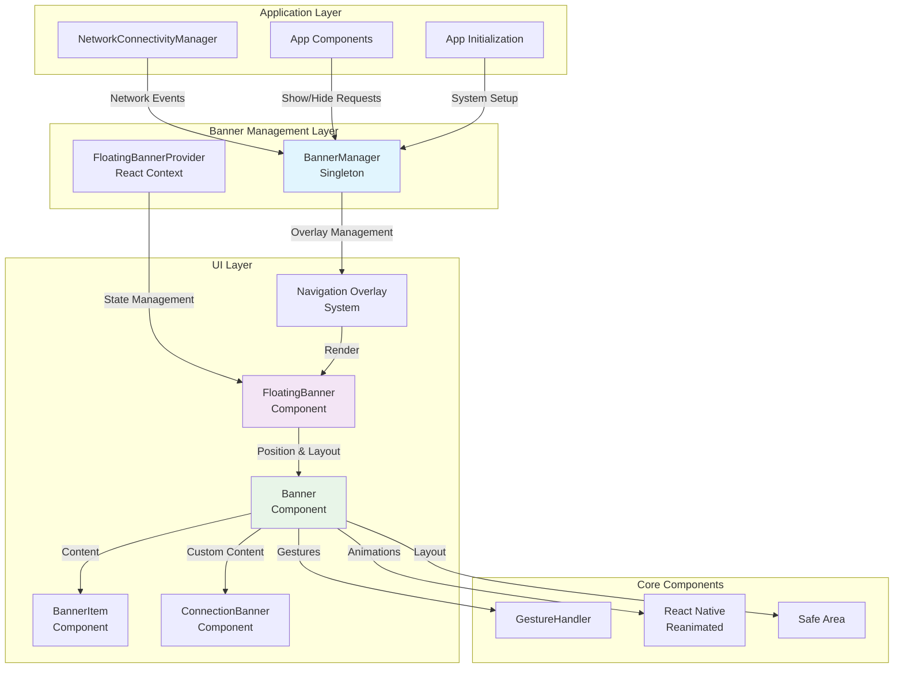
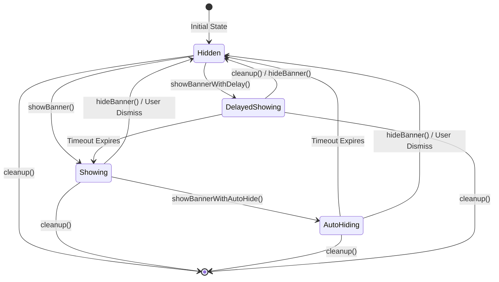
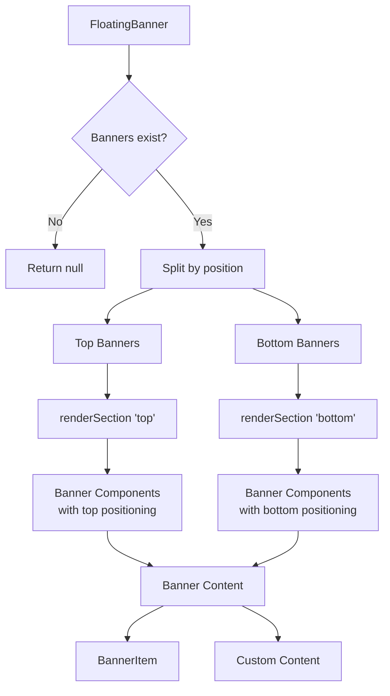
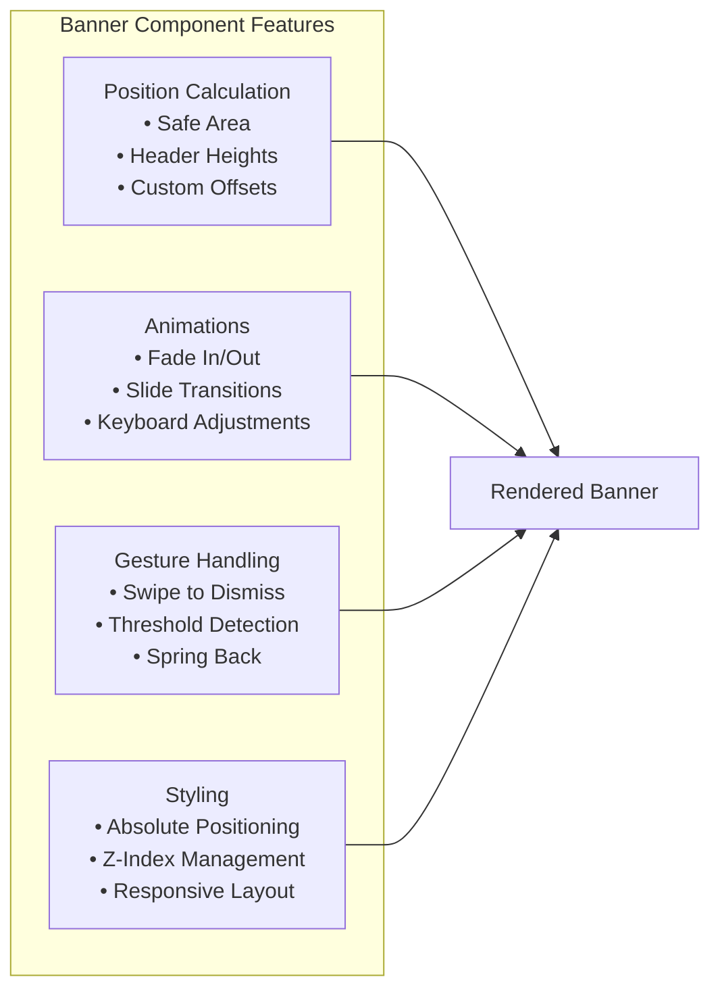
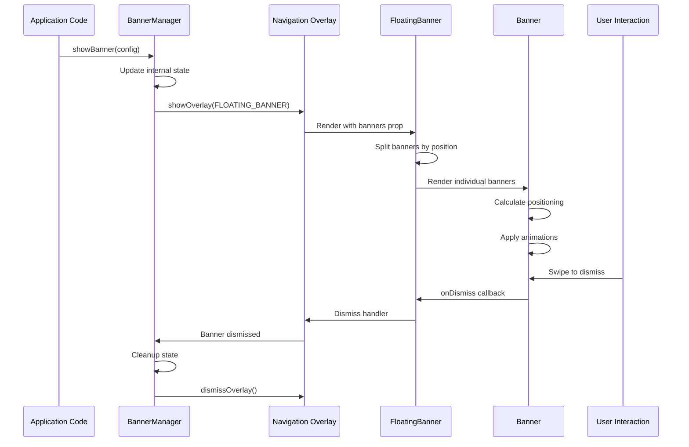
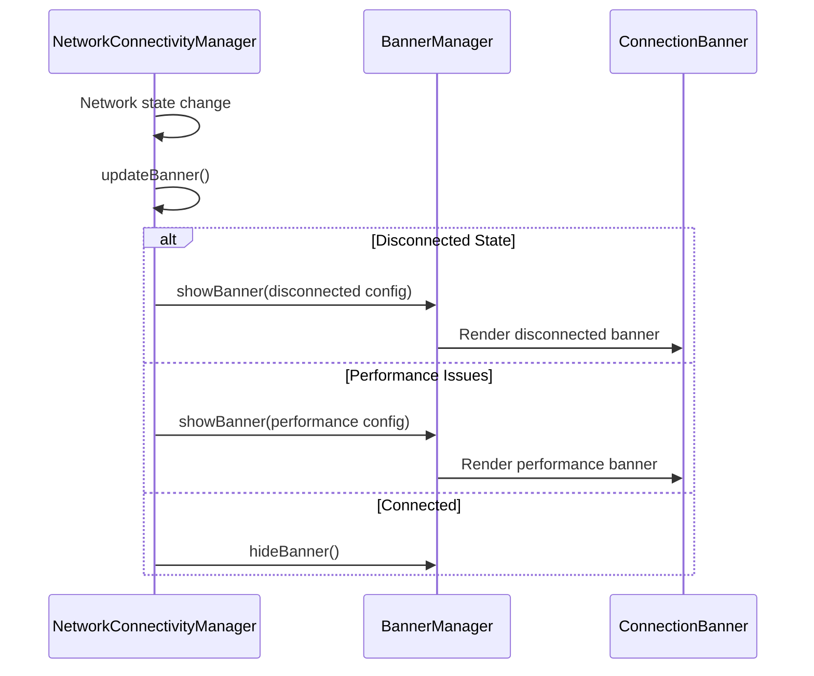
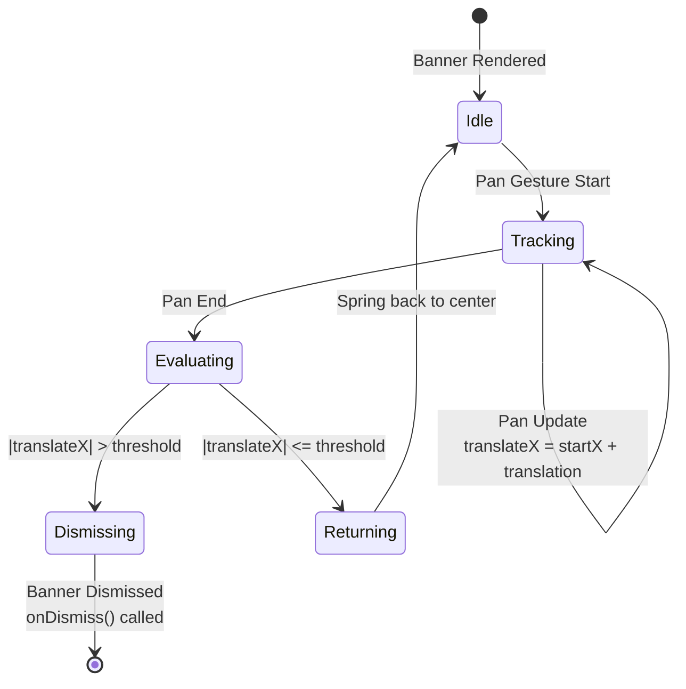

# Floating Banner System

## Overview

The Floating Banner system provides a comprehensive solution for displaying temporary notifications, alerts, and messages in the Mattermost mobile application. It consists of multiple components working together to deliver a smooth, accessible, and highly customizable banner experience.

## System Architecture



## Component Architecture

### 1. BannerManager (Singleton)

**Purpose**: Central controller for banner lifecycle management



**Key Features**:
- Singleton pattern ensures only one banner visible at a time
- Timeout management for delayed showing and auto-hiding
- Overlay system integration
- Error handling for dismiss callbacks
- State tracking (visibility, current banner ID)

### 2. FloatingBanner Component

**Purpose**: Main rendering component that handles multiple banners and positioning



### 3. Banner Component

**Purpose**: Individual banner container with positioning, animations, and gestures



## Data Flow

### Banner Lifecycle



### Network Connectivity Integration



## API Reference

### BannerConfig Interface

```typescript
interface BannerConfig {
    id: string;                    // Unique identifier
    title: string;                 // Banner title text
    message: string;               // Banner message text
    type?: 'info' | 'success' | 'warning' | 'error';  // Visual styling
    dismissible?: boolean;         // Can user dismiss (default: true)
    autoHideDuration?: number;     // Auto-hide timeout in ms
    position?: 'top' | 'bottom';   // Screen position (default: 'top')
    onPress?: () => void;          // Tap handler
    onDismiss?: () => void;        // Dismiss handler
    customContent?: ReactNode;     // Custom banner content
}
```

### BannerManager API

```typescript
class BannerManager {
    // Show banner immediately
    showBanner(config: BannerConfig): void;
    
    // Show banner with auto-hide
    showBannerWithAutoHide(config: BannerConfig, durationMs?: number): void;
    
    // Show banner after delay
    showBannerWithDelay(config: BannerConfig, delayMs?: number): void;
    
    // Hide current banner
    hideBanner(): void;
    
    // Clean up all timeouts and state
    cleanup(): void;
    
    // Get current banner ID
    getCurrentBannerId(): string | null;
    
    // Check if banner is visible
    isBannerVisible(): boolean;
}
```

### FloatingBannerProvider Context API

```typescript
interface BannerContextType {
    banners: BannerConfig[];
    showBanner: (config: BannerConfig) => void;
    hideBanner: (id: string) => void;
    hideAllBanners: () => void;
}

// Convenience hooks
const useBannerActions = () => ({
    showSuccess: (title: string, message: string, options?: Partial<BannerConfig>) => void;
    showError: (title: string, message: string, options?: Partial<BannerConfig>) => void;
    showInfo: (title: string, message: string, options?: Partial<BannerConfig>) => void;
    showWarning: (title: string, message: string, options?: Partial<BannerConfig>) => void;
    showCustom: (config: BannerConfig) => void;
    hideBanner: (id: string) => void;
    hideAllBanners: () => void;
});
```

## Usage Patterns

### 1. Basic Banner Display

```typescript
import {BannerManager} from '@managers/banner_manager';

// Simple info banner
BannerManager.showBanner({
    id: 'welcome-message',
    title: 'Welcome!',
    message: 'Thanks for using Mattermost',
    type: 'success'
});
```

### 2. Auto-hiding Banner

```typescript
// Show banner for 3 seconds
BannerManager.showBannerWithAutoHide({
    id: 'temp-notification',
    title: 'Message Sent',
    message: 'Your message was delivered successfully',
    type: 'success'
}, 3000);
```

### 3. Network Status Banner

```typescript
// In NetworkConnectivityManager
private showDisconnectedBanner() {
    BannerManager.showBanner({
        id: 'network-disconnected',
        title: 'No Connection',
        message: 'Check your internet connection',
        type: 'error',
        position: 'top',
        customContent: (
            <ConnectionBanner 
                isConnected={false}
                message="No internet connection"
                dismissible={true}
                onDismiss={() => this.handleBannerDismiss()}
            />
        )
    });
}
```

### 4. Custom Content Banner

```typescript
// Custom banner with complex content
BannerManager.showBanner({
    id: 'custom-banner',
    title: 'Custom',
    message: 'Custom message',
    customContent: (
        <View style={styles.customBanner}>
            <Text>Custom banner content</Text>
            <Button title="Action" onPress={handleAction} />
        </View>
    ),
    dismissible: true,
    onDismiss: () => console.log('Custom banner dismissed')
});
```

### 5. Context-based Banner Management

```typescript
import {useBannerActions} from '@context/floating_banner';

const MyComponent = () => {
    const {showSuccess, showError, hideAllBanners} = useBannerActions();
    
    const handleSuccess = () => {
        showSuccess('Success!', 'Operation completed successfully');
    };
    
    const handleError = () => {
        showError('Error', 'Something went wrong', {
            autoHideDuration: 5000,
            position: 'bottom'
        });
    };
    
    return (
        <View>
            <Button title="Show Success" onPress={handleSuccess} />
            <Button title="Show Error" onPress={handleError} />
            <Button title="Hide All" onPress={hideAllBanners} />
        </View>
    );
};
```

## Configuration & Positioning

### Position Calculation

The Banner component calculates positions based on:

```typescript
// Top position calculation
let topOffset = safeAreaInsets.top + customTopOffset;

// Add header heights
if (isTablet && !threadScreen) {
    topOffset += TABLET_HEADER_HEIGHT;
} else if (!isTablet && !threadScreen) {
    topOffset += DEFAULT_HEADER_HEIGHT;
}

// Add optional UI element heights
if (includeBookmarkBar) topOffset += BOOKMARKS_BAR_HEIGHT;
if (includeChannelBanner) topOffset += CHANNEL_BANNER_HEIGHT;

// Bottom position calculation  
const baseBottomOffset = isTablet ? 
    (BOTTOM_OFFSET_PHONE + TABLET_EXTRA_BOTTOM_OFFSET) : 
    BOTTOM_OFFSET_PHONE;

// Keyboard adjustment (iOS only)
const adjustedBottom = Platform.OS === 'ios' ? 
    baseBottomOffset + keyboardHeight : 
    baseBottomOffset;
```

### Stacking Behavior

Multiple banners stack with spacing:

```typescript
// Top banners stack downward
const topOffset = index * BANNER_STACK_SPACING;

// Bottom banners stack upward  
const bottomOffset = (index * BANNER_STACK_SPACING) + BOTTOM_BANNER_EXTRA_OFFSET;
```

### Constants

```typescript
const BOTTOM_OFFSET_PHONE = 120;           // Base bottom offset for phones
const TABLET_EXTRA_BOTTOM_OFFSET = 60;     // Additional offset for tablets
const BANNER_STACK_SPACING = 60;           // Spacing between stacked banners
const BOTTOM_BANNER_EXTRA_OFFSET = 8;      // Extra spacing for bottom banners
const TIME_TO_OPEN = 1000;                 // Default delay before showing (ms)
const TIME_TO_CLOSE = 5000;                // Default auto-hide duration (ms)
```

## Animation System

### Fade & Slide Animations

```typescript
// Entry animation
opacity: withTiming(visible ? 1 : 0, {duration: 300})
translateY: withTiming(visible ? 0 : slideOffset, {duration: 300})

// Dismiss animation (swipe)
translateX: withTiming(dismissed ? (swipeDirection > 0 ? 300 : -300) : 0, {duration: 200})
opacity: withTiming(dismissed ? 0 : 1, {duration: 200})
```

### Keyboard Adjustments

```typescript
// iOS keyboard adjustment for bottom banners
const animatedStyle = useAnimatedStyle(() => ({
    bottom: Platform.OS === 'ios' ? 
        withTiming(baseBottomOffset + keyboardHeight, {duration: 250}) :
        baseBottomOffset
}));
```

## Gesture System

### Swipe to Dismiss



```typescript
const swipeGesture = Gesture.Pan()
    .onStart(() => startX.value = translateX.value)
    .onUpdate((event) => {
        if (dismissible) {
            translateX.value = startX.value + event.translationX;
        }
    })
    .onEnd(() => {
        const shouldDismiss = Math.abs(translateX.value) > swipeThreshold;
        if (shouldDismiss && dismissible) {
            // Animate out and dismiss
            translateX.value = withTiming(translateX.value > 0 ? 300 : -300);
            opacity.value = withTiming(0);
            runOnJS(onDismiss)();
        } else {
            // Spring back to center
            translateX.value = withTiming(0);
        }
    });
```

## Error Handling

### Graceful Degradation

```typescript
// BannerManager error handling
const handleDismiss = () => {
    try {
        if (typeof originalOnDismiss === 'function') {
            originalOnDismiss();
        }
    } catch {
        // Silently handle errors to ensure cleanup still runs
    }
    
    // Always perform cleanup
    this.currentOnDismiss = null;
    dismissOverlay(FLOATING_BANNER_OVERLAY_ID);
};
```

### State Recovery

```typescript
// Force fresh show on request - overlay might have been dismissed by navigation
if (this.isVisible) {
    dismissOverlay(FLOATING_BANNER_OVERLAY_ID);
    this.isVisible = false;
    this.currentBannerId = null;
}
```

## Testing Strategy

### Unit Tests

The system includes comprehensive tests covering:

1. **BannerManager Tests**:
   - Singleton pattern verification
   - Banner lifecycle management
   - Timeout handling
   - Error handling in callbacks
   - State management

2. **FloatingBanner Tests**:
   - Banner rendering and positioning
   - Event handling
   - Custom content rendering
   - Keyboard adjustments
   - Tablet-specific behavior

3. **Banner Tests**:
   - Position calculations
   - Animation behavior
   - Gesture handling
   - Dismiss functionality

### Test Utilities

```typescript
// Mock banner configuration
const createMockBanner = (overrides = {}): BannerConfig => ({
    id: 'test-banner-1',
    title: 'Test Banner',
    message: 'This is a test message',
    type: 'info',
    dismissible: true,
    ...overrides,
});

// Test timeout behavior
const mockSetTimeout = jest.spyOn(global, 'setTimeout')
    .mockImplementation((cb: () => void) => {
        cb(); // Execute immediately for testing
        return 1 as unknown as NodeJS.Timeout;
    });
```

## Performance Considerations

### Memory Management

- Automatic timeout cleanup prevents memory leaks
- Singleton pattern reduces object creation
- Component memoization where appropriate

### Animation Performance

- Uses React Native Reanimated for 60fps animations
- Leverages native driver for smooth transitions
- Minimal re-renders through proper state management

### Gesture Performance

- React Native Gesture Handler for native gesture processing
- Optimized pan gesture handling
- Threshold-based dismiss logic

## Integration Points

### Network Connectivity

```typescript
// NetworkConnectivityManager integration
private updateBanner() {
    if (this.handleDisconnectedState()) return;
    if (this.handlePerformanceState()) return;
    if (this.handleConnectingState()) return;
    if (this.handleReconnectionState()) return;
    this.handleConnectedState();
}
```

### App Initialization

```typescript
// App startup integration
export async function initialize() {
    // ... other initialization
    NetworkConnectivityManager.init(activeServerUrl || null);
}
```

### Navigation System

```typescript
// Overlay system integration
showOverlay(
    Screens.FLOATING_BANNER,
    {banners: [configWithDismiss], onDismiss},
    {overlay: {interceptTouchOutside: false}},
    FLOATING_BANNER_OVERLAY_ID
);
```

## Best Practices

### 1. Banner Design

- Keep messages concise and actionable
- Use appropriate banner types (info, success, warning, error)
- Provide clear dismiss mechanisms
- Consider auto-hide for temporary messages

### 2. Timing

- Use delays for non-critical messages
- Auto-hide success messages after 3-5 seconds
- Keep error messages visible until user dismisses
- Avoid banner spam with proper state management

### 3. Accessibility

- Ensure proper contrast ratios
- Provide meaningful text for screen readers
- Support keyboard navigation
- Test with assistive technologies

### 4. Performance

- Minimize banner content complexity
- Use custom content sparingly
- Clean up timeouts and listeners
- Test on lower-end devices

## Troubleshooting

### Common Issues

1. **Banner not showing**:
   - Check if another banner is already visible
   - Verify overlay system is initialized
   - Ensure banner config is valid

2. **Animation glitches**:
   - Check React Native Reanimated setup
   - Verify gesture handler configuration
   - Test on physical devices

3. **Positioning issues**:
   - Verify safe area context is available
   - Check header height calculations
   - Test on different screen sizes

4. **Memory leaks**:
   - Ensure cleanup() is called on unmount
   - Check timeout management
   - Verify callback cleanup

### Debug Tools

```typescript
// Enable debug logging
console.log('Banner state:', {
    isVisible: BannerManager.isBannerVisible(),
    currentId: BannerManager.getCurrentBannerId()
});

// Test banner positioning
const testBanner = {
    id: 'debug-banner',
    title: 'Debug',
    message: 'Testing positioning',
    type: 'info' as const
};
BannerManager.showBanner(testBanner);
```

This comprehensive floating banner system provides a robust foundation for user notifications while maintaining excellent performance and user experience across different device types and usage scenarios.
